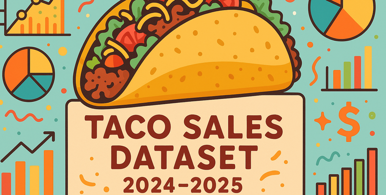

# Taco Sales EDA Project



## Project Overview

This repository contains an end-to-end exploratory data analysis (EDA) of a synthetic taco sales dataset spanning January 2024 through May 2025. The goal is to understand order patterns, delivery performance, pricing and tipping behaviors, and restaurant/city-level insights.

Key deliverables:

* A Jupyter Notebook (`notebooks/01_exploratory_analysis.ipynb`) with step-by-step analysis and visualizations.
* A `reports/taco_eda_report.md` summarizing findings and recommendations with embedded graphics.
* A set of saved figures in `figures/` used in the final report.

## Repository Structure

```
 taco_sales_eda/
 ├── data/
 │   └── taco_sales_(2024-2025).csv   # Raw dataset
 ├── notebooks/
 │   └── eda.ipynb # Main EDA notebook
 ├── requirements.txt                 # Python dependencies
 └── README.md                        # This file
```

## Installation & Setup

1. **Clone the repository**

   ```bash
   git clone <repository_url>
   cd taco_sales_eda
   ```

2. **Create and activate a virtual environment** (recommended)

   ```bash
   python3 -m venv venv
   source venv/bin/activate       # macOS/Linux
   # or
   venv\Scripts\activate        # Windows
   ```

3. **Install dependencies**

   ```bash
   pip install -r requirements.txt
   ```

4. **Launch Jupyter Notebook**

   ```bash
   jupyter notebook notebooks/01_exploratory_analysis.ipynb
   ```

## Usage

* **Data Loading & Cleaning**: The notebook begins by loading `data/taco_sales_(2024-2025).csv`, parsing date fields, and creating new features (e.g., `Order Date`, `Order Hour`, `Weekday`).
* **Univariate & Bivariate Analysis**: Histograms, bar charts, and boxplots explore distributional properties of delivery time, price, tip, toppings, and categorical breakdowns (size, type, weekend vs. weekday).
* **Time Series Analysis**: Daily, weekly, and monthly order volume trends are visualized to reveal seasonality.
* **Advanced Deep Dives**: Includes speed categories by restaurant, tip percentage analyses, and average delivery duration over hours of day.
* **Report Generation**: After running the notebook, key figures are saved to `figures/` and a concise markdown report `reports/taco_eda_report.md` provides a narrative of insights and recommendations.

## Dependencies

* Python 3.8+
* pandas
* matplotlib
* numpy
* jupyter

Install via:

```
pip install pandas matplotlib numpy jupyter
```

## Next Steps

* Build regression models to predict delivery duration or tip amount.
* Develop classifiers for late deliveries (>30 minutes).
* Perform customer segmentation via clustering on order behavior.

## Contribution & License

This is a demonstration project. Feel free to fork, modify, and extend the analyses.

---
